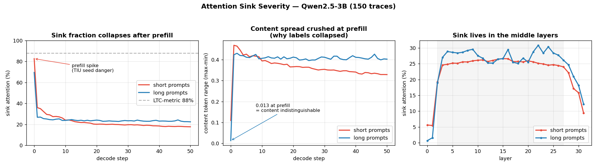

# Study Guide — H2O + ForesightKV

This is your personal study guide. Not published to GitHub.
The goal is that after reading this you can explain every part of the codebase
to anyone — even someone who has never heard of transformers.

---

## Diagrams

### LonghornSilicon Chip Architecture (hardware blocks + where software plugs in)

```
  SOFTWARE (offline — laptop / Colab)                 LOADED ONTO THE CHIP
  ─────────────────────────────────────              ─────────────────────
  train_scorer.py  → 97 int8 scorer weights  ───────► VecU's scorer weight registers
  (train the LLM)  → model weights (billions) ──────► DRAM

  h2o_cache.py, turboquant/, quant_eviction_*.py
     = PRACTICE chip in software. Tests the design (Tracks A/B/C).
       Never runs on the real chip — it just imitates it.


┌─────────────────────────── LonghornSilicon chip (all HARDWARE) ────────────┐
│                                                                             │
│   ┌──────────── ACU — Attention Compute Unit ───────────┐                   │
│   │   MatE = big matrix calculator (Q·Kᵀ , ·V)           │                   │
│   │   VecU = vector calculator (softmax) + RUNS SCORER   │                   │
│   │          └ scorer weight registers ◄─[from train_scorer]                │
│   └────┬──────────────────────────────────┬─────────────┘                   │
│        │ needs decompressed K/V            │ scorer's importance guess       │
│        ▼                                   ▼                                 │
│  ┌──────── KV Cache Engine ────────┐  ┌─────────── TIU ───────────┐          │
│  │ SRAM: compressed K/V (HOT)      │  │ 128 block tally registers │          │
│  │ compress: norm→WHT→Lloyd→QJL    │  │ ranks importance          │          │
│  │ decompress on read              │  │ decides what to evict     │          │
│  └────┬──────────────────▲─────────┘  └───────────┬───────────────┘          │
│       │ "SRAM full!"      │ store                 │ "evict block N"           │
│       ▼                   │                       ▼                           │
│  ┌──────────── MHC — Memory Hierarchy Controller ───────────┐                │
│  │   WARM → spill to DRAM      │      COLD → trash (gone)    │                │
│  └───────────────────────┬─────────────────────────────────-┘                │
└──────────────────────────┼──────────────────────────────────────────────────┘
                           ▼
                     off-chip DRAM
              (model weights + warm/cold KV)
```

**Example generation ("The sky is" → "blue"):**
1. Model weights stream from DRAM → ACU. `[HW]`
2. ACU/MatE runs attention over the prompt. `[HW]`
3. KV Cache Engine compresses each key-value → stores in SRAM. `[HW]`
4. End of prefill: VecU runs the scorer (weights from `train_scorer.py`) → writes importance guesses into the TIU tally. `[HW, weights from SW]`
5. Decode: KV Engine decompresses keys → ACU picks "blue". `[HW]`
6. TIU updates the tally with real attention; scorer guess fades (beta-decay). `[HW]`
7. If SRAM full: TIU names least-important block → KV Engine signals evict → MHC spills to DRAM (warm) or trashes (cold). `[HW]`
8. "blue" becomes a new memory → compressed into SRAM → loop.

**What each track proves:** A = compression doesn't break TIU eviction; B = the scorer predicts well enough to seed the TIU; C = one scorer weight-set is enough (no swappable per-domain bank).

### Part 1 — Training Pipeline (you run this once to build the scorer)

```
STEP 1: collect_traces.py
┌─────────────────────────────────────────────────────────┐
│  140 prompts                                            │
│  for each prompt:                                       │
│    feed prompt into phi-2 (full cache, no eviction)     │
│    generate 50 tokens                                   │
│    at every single step, record:                        │
│      "how much did each token get attended to           │
│       across all 32 layers?"                            │
│  save raw attention data to traces/ folder              │
└─────────────────────────────────────────────────────────┘
                         │
                         ▼
STEP 2: compute_labels.py
┌─────────────────────────────────────────────────────────┐
│  load traces/                                           │
│  for each prompt token:                                 │
│    add up ALL the attention it received                 │
│    across ALL 50 decode steps and ALL 32 layers         │
│    → this is its LTC score (how important was it        │
│      by the END of generation?)                         │
│  normalize each prompt's scores to 0-1                  │
│  save to labels.pt                                      │
└─────────────────────────────────────────────────────────┘
                         │
                         ▼
STEP 3: extract_features.py
┌─────────────────────────────────────────────────────────┐
│  for each token, extract 5 things you can know          │
│  BEFORE generation starts (prefill only):               │
│                                                         │
│  [position in sequence]                                 │
│  [is it one of the first 5 tokens?]                     │
│  [how common is this token in english?]                 │
│  [how much attention did it get during prefill?]        │
│  [which layers attended to it most?]                    │
│                                                         │
│  pair each token's 5 features with its LTC label        │
│  save to features.pt                                    │
└─────────────────────────────────────────────────────────┘
                         │
                         ▼
STEP 4: train_scorer.py
┌─────────────────────────────────────────────────────────┐
│  load features.pt                                       │
│                                                         │
│  train a tiny neural network:                           │
│                                                         │
│  [5 features] → (16 neurons) → [1 importance score]    │
│                                                         │
│  the network learns:                                    │
│  "given these 5 things I can see at prefill,            │
│   predict how important this token will be              │
│   by the end of generation"                             │
│                                                         │
│  save trained weights to scorer.pt (97 numbers total)  │
└─────────────────────────────────────────────────────────┘
```

---

### Part 2 — Inference (what happens when you actually generate text)

```
prompt comes in: "Instruct: Write a haiku about a cat. Output:"

STEP 0: PREFILL (feed the whole prompt at once)
┌─────────────────────────────────────────────────────────┐
│  phi-2 processes all prompt tokens simultaneously       │
│                                                         │
│  HOOK 1 fires (cache adapter):                          │
│    phi-2 tries to save K and V to DynamicCache          │
│    → intercepted → saved to H2OCache instead            │
│                                                         │
│  HOOK 2 fires (forward hook):                           │
│    attention weights captured from all 32 layers        │
│    → passed to H2OCache.update_scores()                 │
│                                                         │
│  IN FORESIGHT MODE:                                     │
│    scores initialized to ZERO (not prefill attention)   │
│    seed_from_prefill() runs:                            │
│      compute 5 features for each prompt token           │
│      run scorer network → predicted importance scores   │
│      replace zeros with those predictions               │
└─────────────────────────────────────────────────────────┘
                         │
                         ▼
STEPS 1-50: DECODE (one new token per step)
┌─────────────────────────────────────────────────────────┐
│  for each new token:                                    │
│                                                         │
│  HOOK 1: save new token's K and V to H2OCache           │
│                                                         │
│  HOOK 2: capture attention weights                      │
│    → add to running importance scores                   │
│                                                         │
│  if cache is over budget:                               │
│    ┌───────────────────────────────────────────┐        │
│    │  EVICTION (_evict)                        │        │
│    │  split cache into two zones:              │        │
│    │                                           │        │
│    │  [recent window] → always kept            │        │
│    │  [everyone else] → ranked by score        │        │
│    │                                           │        │
│    │  keep top scorers + recent window         │        │
│    │  drop the rest                            │        │
│    └───────────────────────────────────────────┘        │
│                                                         │
│  pick next token, repeat                                │
└─────────────────────────────────────────────────────────┘
                         │
                         ▼
                   generated text
```

---

### Part 3 — What the Experiment Measured

```
QUESTION: does the scorer's guess at step 0
          match where H2O ends up after 50 steps?

scorer prediction          H2O accumulator
at step 0                  at step 50
(before any decoding)      (after 50 decode steps)
                                    
token A:  0.9  ─────────?─────────  token A: high score
token B:  0.2  ─────────?─────────  token B: low score
token C:  0.7  ─────────?─────────  token C: high score
token D:  0.1  ─────────?─────────  token D: low score

if they match → positive correlation (pre-seeding helps)
if they disagree → negative correlation (pre-seeding hurts)

YOUR RESULTS:
┌──────────────────────────────────────────────────────┐
│  cross-domain  r = -0.507  (trained on A, tested on B)│
│  within-domain r = +0.084  (trained and tested on A)  │
│                                                        │
│  sign flipped positive when domains matched            │
│  → architecture works, data is the bottleneck          │
└──────────────────────────────────────────────────────┘
```

---

---

## Quantization & Bits — 3-bit deep dive (reference)

**What a bit is:** one 0/1 (a light switch). **N bits = 2^N values.** So `3 bits = 8 values`, `4 bits = 16`, `8 bits = 256`. Each bit doubles the options.

**What quantization is:** the real numbers (key coords) are floats (16–32 bits, ~infinite values). Quantization forces each onto a small **menu** of allowed values and rounds to the nearest. You store the tiny **index** (which menu item) + one shared **scale**, not the full number. That's the compression.

**INT-N naming:** the number = how many bits per value = menu size.
- INT2 = 4 levels, INT3 = 8 levels, INT4 = 16 levels, INT8 = 256 levels.

**The tradeoff (the whole game):** more bits = more accurate but more memory; fewer bits = smaller/faster but coarser. For a 128-number key: FP16 = 2048 bits; INT4 = 512 (4× smaller); INT3 = 384 (~5×); INT2 = 256 (8×). Decode is memory-bound, so fewer bits = smaller KV cache = faster. Goal: fewest bits before quality breaks.

**How to quantize a number (3-bit example, range −8..+8):** chop range into 8 levels (step 2): `-8,-6,-4,-2,0,2,4,6`; round each value to nearest; store its 0–7 index (3 bits) + one scale. Reconstruct = index → level.

**Uniform vs Lloyd-Max:** uniform = evenly-spaced levels (dumb — wastes levels where there's no data). **Lloyd-Max** = place the 8 levels *optimally*, crowded where the data clusters (like putting highway rest-stops near towns, not in empty desert). Same 8 levels, far less error. This is why naive uniform INT3 scored 0.575 but TurboQuant's Lloyd-Max scored higher.

**Why 3-bit is AWKWARD / non-traditional (important):** computers work in **8-bit bytes**, and 2/4/8 divide evenly into 8 but **3 does not** (8÷3 = 2.67). So 3-bit values don't pack cleanly — a value straddles two bytes (you need 3 bytes to hold exactly 8 three-bit values). There's also **no native 3-bit datatype/instruction** on CPUs/GPUs, so it's emulated with slow bit gymnastics. Evidence: turboquant-plus `quantizer.py` literally says *"For bits=3: stored as 4-bit (2 per byte) for simplicity"* — the software reference cheats by using 4-bit slots.

**Why the CHIP can use 3-bit anyway (the payoff):** an **ASIC** (custom chip) *designs its own packing circuitry* (`packer.sv`, custom SRAM word layout), so it packs 3-bit (and the odd 4.25 bpv) natively with no byte-alignment tax. A GPU would waste the savings on packing overhead; a purpose-built chip captures them. **Custom silicon can use "weird" bit-widths that general hardware can't — one of the real reasons the accelerator is worth building.**

**Why 3-bit specifically (not 2 or 4):** 2-bit (4 levels) is too coarse, quality collapses; 4-bit (16 levels) is accurate but 33% more memory; **3-bit + rotation + Lloyd-Max + a 1-bit QJL correction reaches near-4-bit quality at ~3-bit cost** — the sweet spot. TurboQuant's whole pitch is making 3 bits punch above their weight.

**bpv (bits per value) and the 4.25 breakdown:** keys = 3 bits (Lloyd-Max) + 1 bit (QJL on the residual) + ~0.25 bit (shared per-block scale/norm, amortized) = **4.25 bpv**. Values skip QJL → 3-bit ≈ **3.0 bpv**. The 4.25-vs-3.0 split = keys pay 1 extra bit for the dot-product-preserving QJL (because keys are matched via Q·Kᵀ); values don't (they're only gathered content).

---

## The Big Picture

When a language model like phi-2 generates text, it does it one token at a time.
A token is roughly a word or part of a word. Every time it generates a new token,
it has to look back at everything it has generated so far and decide what is relevant.

To avoid recomputing everything from scratch at every step, it saves two vectors
for every past token: K (key) and V (value). This saved data is called the KV cache.
The problem is the cache grows every step and eventually runs out of memory.

H2O solves this by evicting tokens that are not getting much attention.
ForesightKV improves H2O by giving each token a smarter starting score
instead of starting everyone at zero.

---

## The Library Analogy

Attention works like looking something up in a library.

- **Q (query)** is your question. What are you looking for right now?
- **K (key)** is each book's index card. What does this book contain?
- **V (value)** is the actual book content. The real information.

When a new token is generated, it takes its Q and compares it against every
past token's K to figure out which ones are relevant. Then it mixes together
the V vectors of the relevant ones. That mixture is the attention output.

Q is thrown away after each step because it is only useful to the token
that just generated it. K and V are saved because every future token
needs to look at them. That is why it is called the KV cache, not the KQV cache.

---

## What Hooking Means

Hooking means intercepting something that is already happening without
changing the original code. Like a phone tap — two people are talking
and you are listening in without either of them knowing.

In this codebase there are two hooks:

**Hook 1 — the cache adapter.**
Phi-2 calls `past_key_values.update()` every time it wants to save K and V.
Normally this goes to HuggingFace's built-in cache. You replaced
`past_key_values` with your own object that looks identical to phi-2 but
redirects the call to H2OCache instead. Phi-2 has no idea anything changed.

**Hook 2 — the forward hooks.**
After each of phi-2's 32 attention layers finishes running, PyTorch
automatically calls any function you registered with `register_forward_hook`.
You registered one on every layer that reads the attention weights and
passes them to H2OCache. The layer runs completely normally — your function
just fires silently afterward.

---

## File by File

---

### h2o_cache.py — The Core

This is the most important file. Everything else exists to support this one.

**What it stores:**
- `key_cache` — saved K vectors, one slot per layer
- `value_cache` — saved V vectors, one slot per layer
- `accumulated_scores` — running total of how much attention each token has received

**`update(key_states, value_states, layer_idx)`**

Called every forward pass. Adds the new token's K and V to the cache.
On the very first call (step 0, the prefill), it stores the whole prompt.
On every step after that, it appends one new token.
Returns the full cache so attention can run over everything remembered.

Tensor shape coming in: `[1, 32, new_tokens, 80]`
- 1 = batch size (one sequence)
- 32 = attention heads
- new_tokens = prompt length on step 0, then 1 each step after
- 80 = head dimension (phi-2's embedding size 2560 divided by 32 heads)

**`update_scores(attn_weights, layer_idx)`**

Called after attention runs. The attention weights tell you how much each
token was attended to this step. You sum across all heads and all queries
to get one score per token, then add it to the running total.

If the cache is now over budget, call `_evict()`.

In ForesightKV mode, instead of starting the accumulator with the prefill
attention, it starts with zeros. The scorer will replace those zeros
with predicted importance scores right after prefill finishes.

**`_evict(layer_idx)`**

Called when the cache is over budget. Splits the cache into two zones:
- The local window (the last N tokens) — always safe, never evicted
- Everyone else — eviction candidates

Picks the top scorers from the eviction candidates, combines them with
the local window, and drops everything else. Sorts by original position
so the model does not get confused about token order.

**`seed_from_prefill(input_ids, freq_table, scorer_model)`**

ForesightKV only. Called once right after the step 0 forward pass.
Computes 5 features for each prompt token, runs them through the scorer,
and replaces the zero-initialized accumulated scores with the predicted
importance scores. From this point on, accumulation continues normally
on top of those predicted scores.

---

### patch.py — The Two Interception Points

**`H2OCacheAdapter`**

Phi-2 expects `past_key_values` to be a HuggingFace `DynamicCache` object.
DynamicCache has about 10 methods the model calls internally. By inheriting
from it you get all of those for free and only override two:

- `update()` — redirects K and V storage to H2OCache
- `get_seq_length()` — tells phi-2 how many tokens are in the cache
  so it can compute the right position IDs for rotary embeddings

**`patch_model(model, max_cache_size, local_window_size)`**

Registers a forward hook on every one of phi-2's 32 attention layers.
Each hook captures the attention weights after that layer runs and
passes them to `H2OCache.update_scores()`.

The `make_hook(idx)` wrapper exists because of a Python loop closure bug.
If you define the hook directly inside the loop, all 32 hooks would share
the same `layer_idx` variable and by the time any hook fires the loop is
done and `layer_idx` is 31 for all of them. Wrapping in `make_hook(idx)`
captures the correct value immediately for each hook.

Returns the cache, the adapter, and an `unpatch()` function. You must call
`unpatch()` when generation is done or the hooks stay attached to the model
and fire on every future generation, including ones that are not supposed
to use H2O.

---

### collect_traces.py — Recording What Actually Happens

Runs phi-2 on all 140 prompts with a full unlimited cache (no eviction).
At every single decode step, for every one of the 32 layers, records
how much attention each cached token received (summed over all heads).

Saves one file per prompt to the `traces/` folder. Each file contains
a list called `step_attns` where `step_attns[t]` is a tensor of shape
`[32, cache_len_at_step_t]` — one row per layer, one column per token.

Step 0 is the prefill (all prompt tokens processed at once).
Steps 1 through 50 are the decode steps (one new token each).

If you turn your computer off mid-run it picks up where it left off
because it checks if each file already exists before generating.

---

### compute_labels.py — What Does Long-Term Important Actually Mean?

Loads the saved traces and computes the LTC (Long-Term Contribution) score
for every prompt token.

LTC for token p = total attention token p received across ALL decode steps
(steps 1 through 50), summed across all 32 layers.

Step 0 (prefill) is excluded because that attention is concurrent with the
token — we only want future attention, meaning attention from tokens generated
after the prompt.

LTC is then normalized to 0-1 within each prompt so scores are comparable
across prompts of different lengths. The most attended token gets 1.0,
the least attended gets 0.0.

This is the ground truth label. A token with LTC close to 1.0 is genuinely
important — the model kept attending to it throughout the entire generation.
A token with LTC close to 0.0 is safe to evict.

---

### extract_features.py — What Can You Know at Prefill Time?

For each token, extracts 5 features using ONLY information available
before any decoding has happened. No future attention allowed.

| Feature | What it measures |
|---|---|
| normalized position | where in the sequence is this token (0 = first, 1 = last) |
| is sink | is this one of the first 5 tokens (these always get attended to) |
| token frequency | how common is this token in the training corpus |
| prefill attention | how much attention did it receive during the prefill pass |
| layer depth | which layers attended to this token most (early vs late layers) |

Pairs each token's 5 features with its LTC label from compute_labels.py.
This is the training dataset for the scorer.

---

### train_scorer.py — Teaching the Network to Predict Importance

Trains a tiny neural network called the Scorer.

Architecture: 5 inputs → 16 hidden neurons with ReLU → 1 output with Sigmoid.
Total parameters: 97. Extremely small — fits in a hardware register file.

Takes the feature-label pairs from extract_features.py and trains with
mean squared error loss. After training, reports:
- Pearson correlation between predictions and actual LTC scores
- Top-50 overlap (of the 50 tokens the scorer thinks are most important,
  how many actually are in the real top 50)

Also exports the weights as integer constants to `scorer_weights.py`
for eventual hardware implementation (fixed-point arithmetic).

The within-domain experiment retrains on only the 10 Factual-Long training
prompts and tests on 10 Factual-Long eval prompts. This isolates whether
the architecture works from whether the training data is diverse enough.

---

### evaluate.py — Side by Side Comparison

Runs two conditions on every eval prompt:
1. H2O baseline — accumulators start at zero
2. H2O + ForesightKV — accumulators seeded with scorer predictions

Also runs a full-cache baseline (no eviction) to get a reference output.

Measures three things per condition:
- `cold_errors` — tokens with LTC above 0.7 that were evicted in the first 50 steps
- `total_errors` — tokens with LTC above 0.7 that were evicted at any point
- `token_match` — fraction of generated tokens that match the full-cache reference

Prints a comparison table. Lower errors and higher token match = better.

---

### cold_start_alignment.py — The Key Experiment

This is the core experiment for the hardware target.

For each eval prompt:
1. Run the scorer on the prefill features to get predicted importance scores
2. Run H2O baseline for 50 decode steps and let the accumulator settle
3. After 50 steps, compare the scorer's initial predictions against where
   the H2O accumulator actually landed
4. Compute Pearson correlation between the two

**What the correlation means:**
- Positive = scorer predicted the same tokens as important that H2O confirmed
- Near zero = scorer is random noise
- Negative = scorer predicted the wrong tokens as important

**Your results:**
- Cross-domain (trained on 5 domains, tested on 2 different ones): r = -0.507
- Within-domain (trained and tested on Factual-Long only): r = +0.084

The sign flip from negative to positive when the domains match is the key result.
It proves the architecture is correct and the training data is the only problem.

---

## The Numbers That Matter

> ⚠️ **The old Track B scorer numbers (0.791 / 0.780 / 0.734 / 0.998) were a sink-normalization ARTIFACT — SUPERSEDED.** See "Track B/C — CRITICAL CORRECTION (2026-07-07)" below.

| Experiment | Result | What it means |
|---|---|---|
| **Track A: TurboQuant key-quant block agreement** | **0.725** | Real chip key path keeps 72.5% of block eviction decisions (ranking r = 0.996) — **SOLID** |
| **Track B: scorer block-level content corr (long ctx)** | **+0.73** | Corrected metric, sink excluded, 10 long prompts — scorer predicts content-block importance (was −0.611 before the fix) |
| **Track C: per-domain register file** | **not needed** | Specialists (0.691) ≈ generalist (0.686); no inversion; routing 33%. One general scorer + OOD gate. |
| ⚠️ Track B "0.791 / 0.998 / 0.734" (old) | **SUPERSEDED** | sink-normalization artifact — measured "spot the always-kept sink," not real importance |
| ⚠️ Cross-domain −0.507 (v1) | **SUPERSEDED** | broken pipeline; no inversion exists once labels are fixed |

---

## How to Explain This to Anyone

**To someone who knows nothing:**
Language models have a memory problem — they can only remember so many past words at once. H2O decides which words to forget by watching which ones keep getting referenced. The problem is it makes bad decisions in the first 50 steps because it hasn't seen enough to tell what matters yet. ForesightKV trains a tiny network to predict which words will matter before generation even starts, so the first eviction decisions are smarter.

**To someone technical:**
H2O's per-token accumulators are zero-initialized, making the score distribution flat for the first ~50-100 decode steps and causing cold-start eviction errors. ForesightKV pre-seeds those accumulators with a learned prior trained on LTC labels from completed generations. The scorer takes 5 prefill-only features and outputs a predicted importance score before decoding begins.

**To a hardware person:**
The scorer is a 5-16-1 MLP with 97 parameters. It runs **once per prompt** as a VecU epilogue at the end of prefill, pools its per-token output into 128 block scores, seeds the TIU accumulators, then stays silent for the rest of generation. Keep the weights in a **single reprogrammable register set** (so you can update the scorer without a re-tape-out) — but **not** a swappable per-domain bank: the register-file experiment showed specialists ≈ generalist and no inversion, so there's nothing to route to (see Track C, corrected). The OOD gate (β→0 on low confidence) stays as a cheap dormant safety net.

---

## Track A — Quantization Eviction Agreement (2026-06-18)

**Question:** Does TurboQuant key quantization (the real chip path) change which tokens H2O evicts?

**Setup:**
- Model: Qwen2.5-3B-Instruct on Colab T4 (bfloat16, cuda)
- All 10 `LONG_PROMPTS` (157–199 tokens each, 9–12 blocks per prompt), 24 decode steps
- Keys quantized BEFORE the QK dot product (how the chip actually works, not post-softmax)
- H2O token budget = 64, block size = 16
- Four conditions: fp (full precision), tq4 (TurboQuant 4-bit), int4 (naive uniform), int3 (naive uniform)

**Results (averaged over 10 prompts):**

| Condition | token_agree | block_agree | token_r | block_r |
|---|---|---|---|---|
| TurboQuant b=4 | 0.588 | **0.725** | **0.996** | **0.992** |
| Naive INT4 | 0.542 | 0.600 | 0.793 | 0.910 |
| Naive INT3 | 0.519 | 0.575 | 0.797 | 0.808 |

**What the metrics mean:**
- `token_agree` — fraction of the 64-token keep set that matches full precision
- `block_agree` — fraction of the kept 16-token blocks that match full precision (this is the number the chip cares about; budget keeps the top ~4 blocks of 9–12)
- `token_r` — Pearson correlation of the full importance ranking vs fp
- `block_r` — same but after summing importance into 16-token blocks

**The story:**
TurboQuant's Hadamard rotation + Lloyd-Max codebook is designed to preserve inner products (the QK dot product), and it does: even compressed to ~4.25 bits, the attention scores rank tokens almost identically to full precision — `token_r = 0.996`, `block_r = 0.992`, far above naive INT4/INT3 (~0.79). The continuous importance *ordering* is essentially untouched by the real key path.

Block-level keep-set agreement, however, is **0.725**, not perfect. `block_agree` is a hard discrete metric: with budget = 64 the chip keeps only the top ~4 of 9–12 blocks, and blocks near that cutoff have near-equal importance, so a tiny quantization wobble flips which side of the budget they land on. The smooth ranking survives (r ≈ 0.996); the discrete top-k boundary is what's sensitive. TurboQuant is still the best of the three quantizers at block granularity (0.725 vs 0.600 INT4, 0.575 INT3), just not the perfect 1.000 a single prompt suggested.

> **Supersedes the 2026-06-13 single-prompt result.** That run (1 prompt, 10 blocks) reported `block_agree = 1.000` for *both* TurboQuant and naive INT3 — both were small-sample artifacts. INT3's apparent perfection collapsed to 0.575 once averaged over 10 prompts, confirming the 1.000s were luck, not fidelity.

**The headline number:** at the real key path, the importance *ranking* is preserved almost exactly (`token_r = 0.996`) and TurboQuant is clearly the best quantizer, but block-eviction agreement is **0.725** — meaningfully above the naive baselines (~0.59), not the perfect 1.000 the single-prompt test implied. The old 0.68 number came from post-softmax noise + naive INT3 (both wrong assumptions); the honest figure for the real path is ~0.73 block agreement with near-perfect ranking correlation.

### Reference verification — "check your work" against the real repos (2026-06-18)

Cross-checked the implementation against the three LonghornSilicon/turboquant-plus reference repos:
- **quantizer matches.** Our vendored `turboquant/quantizer.py` is byte-identical to turboquant-plus's. `TurboQuantProd(bits=4)` = 3-bit Lloyd-Max MSE + 1-bit QJL on the residual = **4.25 bpv**, which matches the `kv-cache-engine` spec ("keys at 4.25 bpv") exactly. The `dequantize(quantize(K))`→QK^T we used is algebraically identical to the reference's asymmetric `attention_score()` estimator, so the key-path math is faithful, not approximated.
- **Correction:** the "outlier channels kept FP" feature is in `kv_cache.py`'s docstring but **NOT implemented** in `TurboQuantKVCache`. The only real difference from quantize-everything is the **recent-token buffer** (`buffer_size=128`).
- **Wired in:** vendored turboquant-plus's `turboquant/kv_cache.py` and the bit-accurate `kv_cache_engine_ref.py` (pure-Python, verified round-trip at dim=128, key_bpv=4.25 — the silicon ground truth).

### Real-key-path buffer sweep — `quant_eviction_real.py` (2026-06-23)

`quant_eviction_real.py` reproduces `TurboQuantKVCache`'s actual path
(TurboQuantProd + recent-token buffer) and sweeps buffer_size ∈ {0,16,64,128},
all vs full-precision ground truth, averaged over the 10 LONG_PROMPTS:

| buffer_size | block_agree | note |
|---|---|---|
| 0 | **0.725** | quantize all (reproduces quant_eviction_blocks.py exactly) |
| 16 | 0.725 | |
| 64 | 0.700 | |
| 128 | 0.650 | kv_cache.py default |

**Counterintuitive result:** keeping recent tokens full-precision does NOT
improve block-eviction agreement — it slightly *decreases* it (0.725 → 0.650).
Likely cause: uniform quantization (buffer=0) degrades every block consistently,
which preserves their *relative* ranking; a partial buffer creates a precision
discontinuity between FP-recent and quantized-older blocks that can shuffle
borderline blocks across the keep/evict boundary. (Per-prompt the sweep is noisy
and non-monotonic — only 9–12 blocks, top-4 kept.)

**Why this matters:** earlier worry was that quantizing *everything* made 0.725
pessimistic. The sweep shows the opposite — the recent-token buffer is a value-
quality optimization, not an eviction-fidelity one, and doesn't rescue the
number. So **0.725 is the honest, robust headline**, not a conservative artifact.
buffer=0 reproduced quant_eviction_blocks.py to 3 decimals, confirming the real-
path harness is correct.

**Next validation tier (wired, not yet run):** re-run Track A through the
bit-accurate `kv_cache_engine_ref.py` (fixed-point Q3.12, its own rotation +
codebook) for the true-silicon block_agree, including fixed-point rounding.
Needs a quantize-once interception to be tractable (pure-Python per-vector).

---

## Track B/C — CRITICAL CORRECTION: the attention-sink label bug (2026-07-07)

**Everything in the original Track B and Track C sections below used a broken importance label. The headline scorer numbers (0.791 / 0.998 / 0.734 / the −0.507 / the specialist comparisons) were an artifact and are SUPERSEDED.** Here's what actually happened — read this before the old sections.

**Two things changed first:**
1. The scorer pipeline was on **phi-2** the whole time (`collect_traces.py` was `microsoft/phi-2`), not Qwen. Switched it to **Qwen2.5-3B-Instruct** to match Track A + the target workload band.
2. On Qwen, the numbers came out *suspiciously perfect*: cross-domain r = **0.998**, everything ~0.998.

**The red flag → the bug.** Correlation was 0.998 but top-50 overlap was only 0.28–0.76 — a metric that good shouldn't disagree with itself. Root cause: LTC labels were **min-max normalized (÷ the max value)**. Attention **sinks** (the first token) soak up ~all the attention, so the sink WAS the max. Dividing every token by the sink **collapsed all content tokens to ~0**:
- The label became "sink = 1.0, all content ≈ 0."
- The "0.998" was just the scorer **detecting the sink** — trivial, and useless (the sink is always kept anyway).
- Non-sink correlation was actually **−0.118**; non-sink LTC was flat (99% of tokens below 0.05).

**It's a METRIC bug, not a Qwen failure.** Direct attention check on Qwen: healthy distribution — **27% sink, 62% recent, 10% content** (not "99% sink"). phi-2 gave a sane 0.77 only because its sinks are *weaker* (non-sink LTC std 0.28 vs Qwen 0.01) — same bug, mild enough not to fully collapse the label. The newer model's stronger sinks exposed it.

**The fix** (`compute_labels.py`): **content-normalize** — exclude the always-kept sink positions from the normalization range, so content tokens get a real 0–1 spread (and clip sinks to 1).

**Corrected results:**
- **Track B:** block-level content correlation on long prompts flipped from **−0.611 → +0.73** (sink block excluded). The 5 prefill features DO carry real content signal — the scorer genuinely predicts content-block importance. *Caveat: only 10 long prompts.*
- **Track C (re-run on corrected labels):** the register-file conclusion HOLDS and is cleaner — oracle/specialists **0.691** ≈ generalist **0.686** (generalist even wins 3/7 leakage-free), wrong-domain scorer ≈ right (0.676 vs 0.691), routing **32.8%**, **no inversion** (wrong_min 0.648, never negative). **One general scorer + OOD gate; don't build the register file.**

**The real remaining gap:** everything is evaluated on mostly-**short** prompts (degenerate for eviction — sinks + recent window dominate). The meaningful signal is **block-level on LONG context**, where we have only **10 prompts**. Both Track B and Track C need a proper **long-context dataset** before the numbers are trustworthy — that's the next step.

**Lessons:** (1) min-max normalization is fragile when one value is an extreme outlier (the sink). (2) The always-kept sink should never have been in the importance *target*. (3) The metric must be **block-level** (what the chip evicts on), **sink-excluded**, on **long context**.

---

## Sink severity diagnostic — how bad the sinks actually get (2026-07-08)

Measured directly from the 150 saved traces (`traces/`, Qwen2.5-3B, 32 layers). Attention was summed over heads+queries per key token, then **normalized to a per-layer fraction** (÷ total mass) before averaging. First 5 positions = sink. This quantifies the sink problem instead of citing one number.

**Sink fraction by decode step** (avg over layers + prompts):

| step | SHORT sink | SHORT content_range | LONG sink | LONG content_range |
|------|-----------|--------------------|-----------|--------------------|
| 0 (prefill) | **82.7%** | 0.109 | **69.6%** | **0.013** |
| 5   | 29.1% | 0.426 | 24.6% | 0.411 |
| 10  | 24.1% | 0.394 | 23.8% | 0.406 |
| 20  | 20.1% | 0.366 | 24.1% | 0.412 |
| 30  | 19.7% | 0.354 | 23.4% | 0.411 |
| 50  | 17.7% | 0.329 | 22.5% | 0.402 |

**Two findings that matter:**

1. **The sink is catastrophic at prefill, then settles.** 70–83% at step 0, dropping to a steady ~20–25% once decode gets going. It is **not** a flat 88% the whole time. The danger window is the **prefill seed** — which is exactly when the scorer writes the TIU registers. Raw prefill attention is ~83% garbage, so seeding the TIU on sink-excluded scorer output isn't optional, it's load-bearing.

2. **The label-bug smoking gun is in the raw data.** At prefill on long prompts, `content_range = 0.013` — every content token is squeezed into a 0.013-wide band by the sink. That is *why* min-max normalizing by the sink max collapsed content to zero. By step 5 the range is 0.41 (30× wider). Confirms the correction above from an independent angle.

**Sink fraction by layer** (avg over steps + prompts): the sink lives in the **middle layers**. Layers 0–1 barely use it (0.7–5.6%), layers 2–27 are the sink band (~25–30%), layers 28–31 taper off (10–22%). A sink-robust TIU does not need to treat all layers identically.

**Honesty note:** the "~88% sink" figure is the **LTC label** metric (accumulated over the whole trace, which over-weights the prefill spike). The **direct per-step** sink is 20–25% during decode, spiking to 70–83% at prefill. Both true, different measurements — be clear which one when presenting.

Diagnostic is a throwaway script against existing traces (no new run).



*Left: sink fraction craters from the prefill spike down to ~20% by step 5 (the dashed 88% is the LTC-metric, which over-weights prefill). Middle: content token range is ~0.01 at prefill then jumps 30× — the label-bug smoking gun. Right: the sink lives in the middle layers (2–27), barely present at the edges.*

---

## Sink-Robust TIU — the redesign (2026-07-09)

**The problem in one line:** we can't retrain Qwen to stop using the sink (softmax1 / register tokens all need pretraining; LHS serves pretrained models). So instead of removing the sink from the *model*, we make the *TIU* robust to it. The sink is a real token with a **loud key** (attracts huge attention) but a **near-empty value** (injects almost nothing) — so its high attention score is *fake importance*. The TIU's job is to keep it but stop it from corrupting the eviction ranking of everything else.

**Register file layout — one pin bit per block:**

```
┌──────────── TIU register file (128 blocks, 16 tokens each) ────────────┐
│   each register:  [ importance : N-bit fixed point ][ pin : 1 bit ]     │
│                                                                         │
│   block 0   [ 0.84 ][pin=1]  ← SINK block: pinned, never evicted,       │
│                                 AND excluded from the scale calc         │
│   block 1   [ 0.31 ][pin=0]  ┐                                          │
│   block 2   [ 0.12 ][pin=0]  │  content blocks — ranked against          │
│   block 3   [ 0.09 ][pin=0]  │  each other for eviction. The shared      │
│   ...                        │  scale is set by the MAX of THESE          │
│   block 6   [ 0.28 ][pin=0]  │  (sink excluded), so they spread across    │
│   block 7   [ 0.55 ][pin=0]  ┘  the full bit width and stay separable.   │
│   ...                                                                   │
│   block 127 [ 0.71 ][pin=1]  ← RECENCY window: pinned (H2O always keeps) │
└─────────────────────────────────────────────────────────────────────────┘
```

**The four changes (two cheap, one is the real lever, one mostly exists):**

1. **Pin bit — protect the sink from eviction.** 1 bit per register (128 bits total, trivial). Eviction changes from "evict lowest importance" to "evict lowest importance *among blocks where pin==0*." Set pin=1 on the sink block and the recency-window blocks at prefill. Safe whether or not the sink is semantically important — pinning = keeping, and keeping is correct in both cases.

2. **Exclude the sink from the scale — THE REAL LEVER.** When the register file computes its shared fixed-point scale (the `amax` over blocks), exclude pinned blocks. Then the scale is set by the biggest *content* block, not the sink, so content blocks get the full bit width to separate. This is `skip=1` from `compute_labels.py`, in hardware. **Whether this change is even needed depends on the register-file design:** if each block is independent fixed point, the sink never crushed anyone and this is moot; if the file shares one scale, this is *the* fix. **→ Open hardware question: does the TIU register file share a scale across the 128 blocks, or is each independent?**

3. **Sink-excluded scorer seed — cover the prefill window.** The diagnostic above shows the danger is the *prefill* moment (83% sink, content crushed to 0.013). The scorer already runs at prefill and seeds the TIU; the change is that it's *trained sink-excluded*, so the seed ranks content honestly instead of pointing at the always-kept sink. Mostly exists — it's a label/training thing plus the VecU→TIU write path already in the architecture.

4. **Beta-decay handoff — fade the seed as real attention builds.** `importance[b] = beta*importance[b] + attn[b]` for content blocks only; pinned blocks never accumulate, so the sink's ~20% steady-state attention never re-enters the file during decode. The seed is a bridge over the blank early window; real attention takes over by ~step 50. Exists in `h2o_cache.py`, needs the hardware accumulator form.

**What's new vs what exists:**

| Change | Status |
|--------|--------|
| 1. Pin bit | cheap new hardware, standard |
| 2. Sink-excluded scale | the real new lever — depends on register-file design (open hardware question) |
| 3. Sink-excluded scorer seed | mostly exists (VecU write path + sink-excluded training) |
| 4. Beta-decay accumulator | exists in SW, needs HW form |

**Why the sink attention never fades (and why that's fine):** the sink's *attention* drops from ~83% at prefill to ~20% and holds there the whole generation — it never disappears. What fades is the *scorer seed* (beta decay). We don't wait for the sink to go away (it doesn't); we neutralize it with the pin bit + scale exclusion so its permanent ~20% can't hurt the content ranking.

---

## Track B — ForesightKV Scorer Training (2026-06-16) — ⚠️ SUPERSEDED (sink-bug artifact; see correction above)

> ⚠️ **The numbers in this section are the sink-normalization artifact.** They are kept for history only. See "Track B/C — CRITICAL CORRECTION" above for the real story.
>
> **Note:** the final numbers below were produced on a Colab T4 run, not locally.
> The local `scorer.pt` (and `features.pt`/`labels.pt`) will NOT match these results
> and won't be updated — to reproduce, re-run the pipeline on Colab.

**Question:** Can a 97-parameter MLP trained on prefill features predict which tokens will be important, using only what the hardware can see before generation starts?

**Setup:**
- Model: Qwen2.5-3B-Instruct on T4 GPU (bfloat16, cuda)
- 330 prompts total: 256 train, 64 eval, 10 long-prompt (7 categories: QA, Reasoning, Conversational, Code, Creative, Factual-Long, Instructions)
- Label: multi-horizon LTC averaged across horizons 50/100/150/200 steps, **200 decode steps per trace**
- Features: 5 prefill-only features (position, sink, late-layer attention, early-layer attention, layer consistency)
- Scorer: Linear(5,16) → ReLU → Linear(16,1) → Sigmoid (97 params)
- Training: 200 epochs, CosineAnnealingLR, MSE + MarginRankingLoss(weight=0.3)

**Final cross-domain results (trained on 256 prompts, tested on 64 held-out prompts):**

| Epoch | val_mse | corr | top50_overlap |
|---|---|---|---|
| 20 | 0.0789 | 0.199 | 0.000 |
| 40 | 0.0636 | 0.473 | 0.000 |
| 60 | 0.0544 | 0.561 | 0.000 |
| 80 | 0.0492 | 0.612 | 0.000 |
| 100 | 0.0443 | 0.678 | 0.000 |
| 120 | 0.0400 | 0.729 | 0.000 |
| 140 | 0.0369 | 0.762 | 0.000 |
| 160 | 0.0351 | 0.781 | 0.000 |
| 180 | 0.0343 | 0.789 | 0.000 |
| 200 | 0.0340 | **0.791** | 0.000 |

**Final within-domain results (trained on Factual-Long prompts 200-255, tested on 256-279):**

| Epoch | val_mse | corr | top50_overlap |
|---|---|---|---|
| 20 | 0.0756 | 0.135 | 0.480 |
| 40 | 0.0584 | 0.416 | 0.480 |
| 60 | 0.0527 | 0.494 | 0.480 |
| 80 | 0.0487 | 0.562 | 0.960 |
| 100 | 0.0443 | 0.637 | 0.960 |
| 120 | 0.0398 | 0.704 | 0.960 |
| 140 | 0.0364 | 0.751 | 0.960 |
| 160 | 0.0346 | 0.771 | 0.960 |
| 180 | 0.0338 | 0.778 | 0.960 |
| 200 | 0.0336 | **0.780** | **0.960** |

**Block-level agreement (the number the chip cares about):**
After pooling per-token scorer outputs into 16-token blocks (mean within each block), compared against `ltc_blocks` ground truth. Evaluated on 64 held-out prompts, comparing top-50% of blocks:

**block_agree = 0.734**

The scorer identifies 73.4% of the important 16-token blocks correctly at prefill time, before any decode step runs. Random baseline = 0.500.

**Note on top50_overlap = 0.000 in cross-domain:**
The eval set is 64 prompts concatenated into ~1036 tokens. top-50 is measured globally across all tokens, which concentrates in whichever prompts happen to have the highest absolute LTC. With short diverse prompts (10-43 tokens each), the model can have r=0.791 correlation without ever landing in the same global top-50. Block-level agreement (0.734) is the more meaningful metric for hardware.

**What changed from the original -0.507 result:**

| Change | Impact |
|---|---|
| Label horizon: 50 → 200 steps + multi-horizon averaging | Labels now capture long-term importance, not just 50-step noise |
| Features: frequency/raw prefill → late-layer/early-layer/consistency | Features now measure semantic signal, not surface statistics |
| Training: 40 epochs → 200 + CosineAnnealingLR + MarginRankingLoss | Longer training + ranking loss taught relative ordering, not just values |
| Prompts: 140 → 330 (Factual-Long: 20 → 80) | More diverse training, bigger within-domain experiment |

**The key result:**
Cross-domain r = +0.791 means the scorer generalizes — it is not overfitting to one type of text. Block-level agreement = 0.734 means 73% of the important blocks the TIU would track are correctly identified at prefill. Within-domain r = +0.780 with 96% top-50 overlap means the architecture is not the bottleneck.

**The conclusion:**
Architecture works. Data was the bottleneck. With 330 prompts and 200-step labels the scorer crosses r=0.79 cross-domain and block_agree=0.734 — well above the random baseline of 0.5. ForesightKV pre-seeding will meaningfully shift eviction decisions at the start of generation.

---

## Track C — Per-Domain Scorer Bank (Register File Experiment, 2026-06-18) — ⚠️ numbers below on sink-buggy labels

> ⚠️ **The specific numbers in this section used the sink-buggy labels (phi-2, then unseeded Qwen).** The *conclusion* (don't build the register file) survived re-running on corrected labels — see "Track B/C — CRITICAL CORRECTION" above for the corrected figures (oracle 0.691 ≈ general 0.686, no inversion, routing 33%). This section is kept for the journey.

**Question:** Does a BANK of per-domain specialist scorers beat the single general scorer? This is the empirical test of the programmable-register-file thesis — instead of one set of 97 weights baked into silicon, hold one weight set per workload and load the matching one (with the OOD gate as fallback when none match).

**Setup:**
- Regenerated the full 330-prompt trace pipeline on Colab T4 (the prior features.pt/labels.pt were lost — ephemeral Colab + gitignored; now backed up to Drive at `MyDrive/h2o_data/`).
- `train_domain_bank.py`: one Scorer per domain (7 domains), trained only on that domain's prompts, 80/20 within-domain train/test split, same architecture/loss/epochs as the general scorer. Each scorer stores its own feat_mean/feat_std for routing.

**Reproducibility note (re-run of the general scorer on regenerated data):**

| Metric | Original (2026-06-16) | Re-run (2026-06-18) |
|---|---|---|
| Block-level agreement | 0.734 | **0.734** (exact) |
| Within-domain r | 0.780 | **0.778** |
| Cross-domain r | 0.791 | **0.747** |

block_agree and within-domain reproduce exactly → the regenerated dataset is correct. Cross-domain r varies ±0.04 run-to-run because training is **not seeded** (DataLoader shuffle). TODO: set a fixed seed so cross-domain r is reproducible.

**Bank results (per-domain, each on its own held-out test prompts):**

| Domain | Train prompts | Test prompts | corr | top50 |
|---|---|---|---|---|
| Factual-Long | **64** | 16 | **0.843** | 0.640 |
| Reasoning | 32 | 8 | 0.698 | 0.680 |
| Creative | 32 | 8 | 0.677 | 0.660 |
| QA | 32 | 8 | 0.613 | 0.940 |
| Instructions | 32 | 8 | 0.583 | 0.620 |
| Code | 32 | 8 | 0.558 | 0.640 |
| Conversational | 32 | 8 | 0.557 | 0.500 |
| **MEAN per-domain** | | | **0.647** | |

**The finding (data starvation, not a refutation of specialization):**
The bank's mean per-domain r (0.647) is *below* the general scorer (0.747). But this is a data-quantity artifact, not evidence that specialization fails. Each specialist trains on only ~32 prompts (~500 tokens); the generalist trains on 256 prompts (4564 tokens) and benefits from cross-domain regularities. The tell: **Factual-Long, the only domain with 2× the data (64 prompts), scored 0.843 — clearly beating the generalist**, while every 32-prompt domain clustered at 0.55–0.70. More per-domain data → better specialist.

**Caveat — not yet apples-to-apples:** the generalist's 0.747 is measured on a mixed 64-prompt eval set, while each specialist is measured on its own domain's test set. A fair comparison evaluates the generalist ON each domain's test set (the "single general scorer" policy in the planned routing eval, Part 3).

**The conclusion (the cheap lesson):**
At ~300 total prompts, per-domain specialization can't be fairly tested — splitting the data into 7 piles starves each scorer. The register-file thesis is not refuted (Factual-Long signals specialists would win with enough data), but to test it properly you need **a few hundred prompts PER domain, not in total**. This is exactly the "learn it on 300 prompts, not 3,000" outcome: scale per-domain data before scaling the number of domains.

### Parts 2 & 3 — Router + four-policy eval (2026-06-18)

`eval_domain_bank.py`: a z-score router (route a prompt to the bank scorer whose
training distribution it's closest to; gate to beta=0 if none match) plus a
four-policy comparison on each domain's OWN held-out test set.

| Domain | oracle | learned | general* | wrong_min | wrong_avg |
|---|---|---|---|---|---|
| Code | 0.558 | 0.559 | 0.713 | 0.555 | 0.655 |
| Conversational | 0.557 | 0.599 | 0.723 | 0.559 | 0.662 |
| Creative | 0.677 | 0.580 | 0.740 | 0.575 | 0.661 |
| Factual-Long | **0.843** | 0.589 | 0.729 | 0.564 | 0.621 |
| Instructions | 0.583 | 0.664 | **0.749** | 0.578 | 0.682 |
| QA | 0.613 | 0.641 | 0.756 | 0.568 | 0.676 |
| Reasoning | 0.698 | 0.653 | 0.676 | 0.535 | 0.599 |
| **MEAN** | 0.647 | 0.612 | 0.727 | 0.562 | 0.651 |

Routing accuracy (router picks true domain): **35.9%**.
Held-out gate (own scorer removed, prompts tripping OOD z>3.0): **0%**.

**\*Leakage caveat:** the general scorer trains on idx 0–255, which CONTAINS the
bank test prompts for QA/Reasoning/Conversational/Code/Creative — so the general
column is inflated (evaluated on trained-on prompts) for those 5 domains. Only
**Factual-Long** (test 264–279) and **Instructions** (312–319) are clean
held-out tests for the generalist. A leakage-free comparison requires retraining
the general scorer with all bank test prompts excluded.

**Findings (the robust, leakage-proof ones):**
1. **No inversion.** wrong_min never goes negative (min 0.535) — a mismatched
   prior is only mildly worse than the right one, not catastrophic. The
   original −0.507 inversion was an artifact of the OLD broken pipeline
   (50-step labels + surface features), NOT a fundamental property. With the
   fixed pipeline, token importance is largely **domain-general**.
2. **Routing is unreliable** (35.9%) — the 5 prefill features don't separate
   these domains in feature space; `learned` routing (0.612) is worse than
   using any single scorer.
3. **The OOD gate is dormant among in-distribution domains** (0%) — these 7
   domains share a feature region; the gate is a safety net for genuinely alien
   workloads, not a domain router.
4. **Specialists are data-starved.** Clean evidence: Factual-Long (64 prompts)
   oracle 0.843 beats the generalist even leakage-free; Instructions (32
   prompts) specialist 0.583 loses to the generalist's 0.749. More per-domain
   data → better specialist.

**Revised conclusion (supersedes the Track-C-Part-1 lean toward specialization):**
The programmable-register-file / per-domain-bank thesis is **largely not
supported** at this task and scale. A single general scorer generalizes well;
per-domain routing is unreliable and unnecessary; wrong priors don't invert.
The cleaner architecture is ONE general scorer (fixed or single programmable
weight set) plus the OOD gate kept as a cheap dormant safety net for alien
inputs. The register file would only pay off if (a) you collect hundreds of
prompts PER domain (so specialists stop starving) AND (b) the workloads are
actually feature-separable — neither holds here.

**Open follow-up:** retrain the general scorer excluding all bank test prompts,
to nail the leakage-free general-vs-oracle comparison.

### Part 4 — Leakage-free retrain + reproducibility crisis (2026-06-23)

`train_general_clean.py` retrains the general scorer excluding ALL 64 bank test
prompts, then compares leakage-free against each oracle. Fresh full re-run:

| Domain | oracle | general (clean) | winner |
|---|---|---|---|
| Code | 0.645 | 0.612 | oracle |
| Conversational | 0.606 | 0.619 | general |
| Creative | 0.754 | 0.639 | oracle |
| Factual-Long | 0.853 | 0.627 | oracle |
| Instructions | 0.666 | 0.645 | oracle |
| QA | 0.648 | 0.658 | general |
| Reasoning | 0.620 | 0.582 | oracle |
| **MEAN** | **0.685** | **0.626** | oracle 5/7 |

**This FLIPS the Part-2/3 conclusion** — leakage-free, the oracle specialists
beat the generalist (0.685 vs 0.626, winning 5/7). The earlier "generalist wins"
came from a leaky general column AND a run where the general happened to train
strong.

**…but it's inside the noise. Training is unseeded and the variance is large:**

| Metric | run 1 (06-16) | run 2 (06-18) | run 3 (06-23) |
|---|---|---|---|
| Cross-domain r | 0.791 | 0.747 | **0.632** |
| Within-domain r | 0.780 | 0.778 | **0.880** |
| Scorer block_agree | 0.734 | — | **0.812** |
| Bank mean per-domain | — | 0.647 | 0.685 |

Cross-domain r swings 0.63–0.79; within-domain 0.78–0.88. The oracle-vs-general
gap (0.06) is **smaller than the run-to-run variance**, so a single run cannot
decide register-file-vs-generalist either way.

**Honest conclusion (run-stable findings only):**
1. **No inversion** — wrong_min never negative across runs (0.56–0.65). The
   −0.507 was a broken-pipeline artifact. Robust.
2. **Routing unreliable** (35.9%, deterministic) and **gate dormant** (0%). Robust.
3. **Specialists data-starved except Factual-Long** (0.853 with 2× data). Robust.
4. **General-vs-specialist is a statistical tie at this scale** — cannot be
   called without seeding + multi-run averaging. NOT robust; do not report a
   winner externally.

**CRITICAL TODO before the email:** seed all training (`torch.manual_seed`,
seeded DataLoader generator) and re-run, OR average ≥3 runs and report mean ± sd.
The current swing (±0.08 cross-domain) is too large to put a single headline
number in front of anyone. Track A (0.725, deterministic) is unaffected.

### Part 5 — SEEDED final numbers (SEED=42, reproducible, 2026-06-23)

All training now seeded (`set_seed()` in train_scorer/train_domain_bank/
train_general_clean). Verified byte-identical across re-runs. These are the
citable numbers.

**Track B (scorer), seed 42:**
- Cross-domain r = **0.771** (unseeded range was 0.63–0.79; 0.771 is the seed-42 draw)
- Within-domain r (Factual-Long) = **0.893**, top50 = 0.960
- Scorer block_agree = **0.734** (reproduces the original exactly — block_agree is the most stable metric)

**Track C bank mean per-domain = 0.722** (QA 0.715, Reasoning 0.671,
Conversational 0.661, Code 0.674, Creative 0.693, Factual-Long 0.927,
Instructions 0.716).

**Track C leakage-free (seed 42), oracle vs general:**

| | oracle (specialist) | general (clean) | learned routing | wrong_avg (mismatched specialist) |
|---|---|---|---|---|
| MEAN | **0.722** | 0.662 | 0.703 | 0.720 |

Specialists win **7/7** domains leakage-free. Routing 35.9%, gate 0%.

**What's now robust (consistent across both leakage-free runs, 06-18 and 06-23):**
1. **Fair-comparison: single-domain specialists beat the mixture-trained
   generalist by ~0.06** (oracle 0.722 vs general 0.662; same +0.06 margin as the
   unseeded 0.685 vs 0.626). The earlier "generalist wins" was purely the
   leakage artifact, not a real effect.
2. **But it is NOT a routing win: wrong_avg (0.720) ≈ oracle (0.722).** Using
   *any* single-domain scorer is as good as the *correct* one — and all of them
   beat the generalist. So the benefit is from training on COHERENT single-domain
   data, NOT from matching the workload. Per-domain routing is pointless here
   (router is 36% anyway, and being right doesn't help).
3. **No inversion** (wrong_min 0.625–0.692, never negative). Robust.

**Architectural conclusion (seeded, fair):** a per-domain register file *with a
router* is **not** justified — routing is unreliable AND a mismatched scorer
works just as well, so there's nothing to route. The real, reproducible signal
is that a scorer trained on coherent data beats one trained on a heterogeneous
mix (~0.06), and that everything is small-data-noisy. The practical
recommendation stays: ONE general scorer + OOD gate as a dormant safety net, and
**scale data** (the +0.06 and the variance are both data-limited symptoms). The
seed makes numbers reproducible; it does not make the ~0.06 gaps large — they sit
in the small-data regime, so report them with the variance, not as hard wins.
